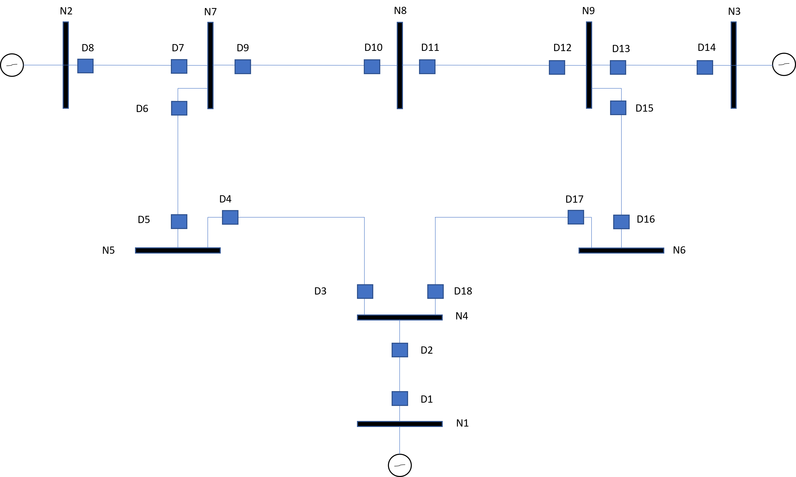
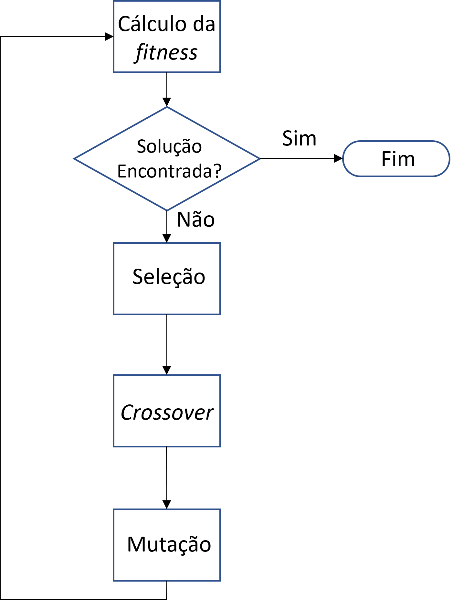
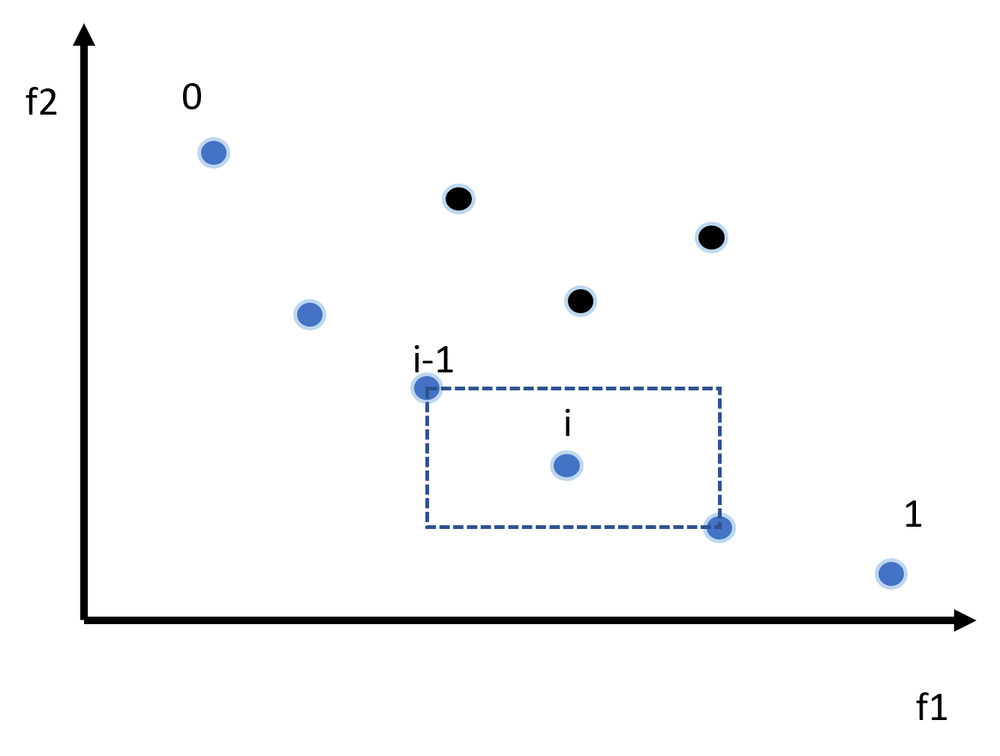

# Alocação Otimizada de Dispositivos Limitadores de Corrente via Algoritmo Genético Multiobjetivo

## Descrição

Implementação de um algoritmo genético multiobjetivo baseado no NSGA-II para alocação otimizada de Dispositivos Limitadores de Corrente (DLCs) em sistemas elétricos de potência. O algoritmo busca minimizar simultaneamente as correntes de curto-circuito trifásico e o custo de instalação dos dispositivos.

Trabalho desenvolvido como Trabalho de Conclusão de Curso (TCC) em 2019.

## Sistema Teste

Sistema IEEE 15 barras, com dados de impedância e topologia definidos no arquivo `15BusTestSystems.xlsx`.

<p align="center">
  
</p>

## Metodologia

O sistema elétrico é modelado a partir da matriz de impedância de barra (Zbarra), obtida pela inversão da matriz de admitância (Ybarra). A análise de curto-circuito trifásico é realizada para todas as barras do sistema, calculando correntes de falta, tensões nas barras e correntes nas linhas.

A otimização é conduzida por um algoritmo genético multiobjetivo (NSGA-II) com as seguintes características:

<p align="center">
  
</p>

* **Codificação:** Binária, com 12 bits por indivíduo (3 grupos de 4 bits), cada grupo representando um DLC candidato em uma barra específica.
* **Funções objetivo:**
  + f1: Minimização da corrente total de curto-circuito.
  + f2: Minimização do custo total dos DLCs.
* **Seleção:** Torneio binário baseado em frente de dominância e distância de agrupamento.
* **Cruzamento:** Uniforme, utilizando máscara binária aleatória.
* **Mutação:** Bit-flip em indivíduo selecionado aleatoriamente.
* **Frentes de Pareto:** Classificação por não-dominância.
* **Distância de agrupamento:** Preservação da diversidade na fronteira de Pareto.

<p align="center">
  
</p>


## Estrutura do Repositório

```
alocacao-dlcs/
├── nsgaii.py # Código principal do algoritmo genético
├── 15BusTestSystems.xlsx # Dados do sistema elétrico (linhas, impedâncias, base)
├── conexoes.xlsx # Pares de relés primário/backup
├── requirements.txt # Dependências Python
├── img/
│ ├── 15bus.png # Diagrama do sistema IEEE 15 barras
│ ├── fluxograma_nsgaii.png
│ ├── fluxograma_ag.png
│ ├── pareto1.png
│ └── pareto2.png
└── README.md
```

## Dependências

- Python 3.x
- NumPy
- Pandas
- Matplotlib
- pythonds

## Execução

```bash
pip install numpy pandas matplotlib pythonds
python nsgaii.py
```

## Saídas

- `saida.xlsx`: Impedâncias dos DLCs alocados para cada indivíduo da população final.
- `final.xlsx`: Soluções filtradas pelas restrições do problema (f1 > 30, 0 < f2 < 80).
- Gráfico de dispersão da fronteira de Pareto (f1 × f2).

## Referências

1. MAHMOUDIAN, A.; NIASATI, M.; KHANESAR, M. A. *Multi objective optimal allocation of fault current limiters in power system*. International Journal of Electrical Power and Energy Systems, v. 85, p. 1–11, 2017.

2. DEB, K.; PRATAP, A.; AGARWAL, S.; MEYARIVAN, T. *A Fast and Elitist Multiobjective Genetic Algorithm: NSGA-II*. IEEE Transactions on Evolutionary Computation, v. 6, n. 2, p. 182–197, 2002.

3. ELMITWALLY, A.; GOUDA, E.; ELADAWY, S. *Optimal allocation of fault current limiters for sustaining overcurrent relays coordination in a power system with distributed generation*. Alexandria Engineering Journal, v. 54, n. 4, p. 1077–1089, 2015.

4. SHAHRIARI, S.; YAZDIAN, A.; HAGHIFAM, M. *Fault current limiter allocation and sizing in distribution system in presence of distributed generation*. IEEE Power and Energy Society General Meeting, 2009, p. 1–6.

5. SCHMITT, H. et al. *Fault Current Limiters — Report on the Activities of CIGRE WG A3.16*. IEEE PES General Meeting, 2006.

6. KHEIROLLAHI, R.; TAHMASEBIFAR, R.; DEHGHANPOUR, E. *Genetic Algorithm Based Optimal Coordination of Overcurrent Relays Using a Novel Objective Function*. International Electrical Engineering Journal (IEEJ), v. 7, n. 10, p. 2403–2414, 2017.

7. REZAEI, N.; UDDIN, M. N.; AMIN, I. K.; OTHMAN, M. L.; MARSADEK, M. *Genetic Algorithm Based Optimization of Overcurrent Relay Coordination for Improved Protection of DFIG Operated Wind Farms*. IEEE Power Systems Protection Conference (PSPC), 2018.

8. CHIPPERFIELD, A. J.; FLEMING, P. J.; FONSECA, C. M. *Genetic Algorithm Tools for Control Systems Engineering*. Proc. International Conference on Adaptive Computing in Engineering Design and Control, Plymouth, UK, 1994.

9. AMRAEE, T. *Coordination of Directional Overcurrent Relays Using Seeker Algorithm*. IEEE Transactions on Power Delivery, v. 27, n. 3, p. 1415–1422, 2012.